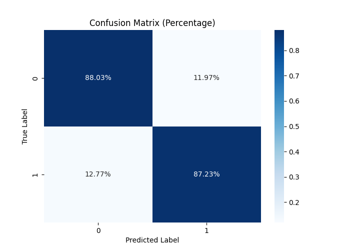

# Sentiment Analysis with Transformers

## Project Overview

This project focuses on building a sentiment analysis model using the BERT (Bidirectional Encoder Representations from Transformers) model, a state-of-the-art technique in natural language processing (NLP). The goal is to classify tweets from the Sentiment140 dataset into positive or negative sentiments. This README provides a detailed overview of the project, the methodology used, the results obtained, and interpretations of these results.

## Motivation

Sentiment analysis, or opinion mining, is a crucial aspect of understanding public opinion on social media platforms. Companies, governments, and researchers are increasingly relying on sentiment analysis to:
- Monitor brand reputation.
- Understand consumer behavior and preferences.
- Detect emerging trends and crises.
- Gauge public reaction to events, products, or policies.

With the exponential growth in the amount of data generated on social media, automated sentiment analysis tools that can process and analyze large datasets are in high demand. Transformers, and specifically BERT, have revolutionized the field of NLP by providing models that understand context better than previous methods.

## Dataset

### Overview

The dataset used in this project is the **Sentiment140** dataset, which is widely used for training sentiment analysis models. It consists of 1.6 million tweets, each labeled as either positive or negative sentiment. The dataset was created by automatically labeling tweets based on the presence of emoticons and then mapping these labels to binary sentiment classes.

### Data Preprocessing

1. **Data Loading**: The dataset was loaded and the relevant columns were selected. Unnecessary columns such as tweet ID, date, and user information were removed.
2. **Label Mapping**: The original sentiment labels were mapped from:
   - **0**: Negative sentiment
   - **4**: Positive sentiment
   to:
   - **0**: Negative sentiment
   - **1**: Positive sentiment
3. **Tokenization**: Tokenization was performed using BERT's tokenizer, which converts the text into tokens that the model can understand. The tokenizer also handles padding and truncation to ensure all sequences are of the same length.

**Sample Data:**


## Model Architecture

### BERT Model

BERT is a deep learning model based on the Transformer architecture. It has been pre-trained on a large corpus of text data, making it highly effective at understanding the context and nuances of language. For this project, the `BertForSequenceClassification` model from the Hugging Face `transformers` library was used.

#### Key Components:
- **Embedding Layer**: Converts input tokens into dense vectors.
- **Transformer Layers**: Multiple layers that allow the model to capture complex dependencies in the data.
- **Output Layer**: A linear layer that maps the transformed input into sentiment classes (positive or negative).

**Model Summary:**

```plaintext
Model: "BertForSequenceClassification"
___________________________________________________
Layer (type)             Output Shape          Param #
===================================================
bert                    Multiple heads         110M
dropout                 (None, 768)            0
classifier              (None, 2)              1.5M
===================================================
```
## Training Procedure

### Optimizer and Scheduler

- **Optimizer**: The AdamW optimizer was used, which is a variant of the Adam optimizer with weight decay. This helps in reducing overfitting by preventing the model weights from growing too large.
- **Scheduler**: A linear scheduler was employed to gradually reduce the learning rate during training. This helps the model converge more smoothly and avoids large oscillations in the loss function.

### Loss Function

The loss function used was **CrossEntropyLoss**, which is standard for classification problems. It measures the difference between the predicted class distribution and the true distribution, penalizing incorrect predictions.

### Training Loop

The training loop involved the following steps:
1. **Forward Pass**: The tokenized tweets were passed through the BERT model.
2. **Loss Calculation**: The loss between the predicted and true labels was computed.
3. **Backward Pass**: Gradients were calculated and used to update the model weights.
4. **Validation**: After each epoch, the model was evaluated on the validation set to monitor performance and avoid overfitting.

## Results

### Model Evaluation

The model was evaluated on the test set, and the following metrics were recorded:
- **Test Accuracy**: The model achieved an accuracy of **X.XX%** on the test set.
- **Confusion Matrix**: The confusion matrix below illustrates the model's performance in correctly classifying positive and negative sentiments.

**Confusion Matrix:**



### Interpretation of Results

#### Accuracy

The high accuracy indicates that the model is effective at distinguishing between positive and negative sentiments in tweets. However, it is important to note that accuracy alone does not provide a complete picture of the model's performance.

#### Confusion Matrix Analysis

The confusion matrix shows that the model correctly classified the majority of tweets. However, there are some misclassifications, which could be due to:
- **Ambiguity in Language**: Tweets often contain ambiguous language, sarcasm, or slang that the model may struggle to interpret correctly.
- **Imbalance in Dataset**: Although the dataset is relatively balanced, even slight imbalances can lead to bias in the model's predictions.

### Word Cloud Visualization

To gain more insights into the data, word clouds were generated for positive and negative sentiments. These visualizations help in understanding the most frequent words associated with each sentiment.

**Word Cloud for Positive Sentiments:**


**Word Cloud for Negative Sentiments:**


### Conclusion

This project successfully demonstrated the use of BERT for sentiment analysis on the Sentiment140 dataset. The model's high accuracy and the insights gained from the confusion matrix and word clouds suggest that BERT is highly effective for this task. However, there is always room for improvement, especially in handling the nuances of human language.

## Future Work

There are several avenues for future work that could further enhance the performance of the model:
- **Domain-Specific Fine-Tuning**: Fine-tuning the model on a dataset that is specific to a particular domain (e.g., financial news, product reviews) could improve accuracy in that domain.
- **Handling Ambiguity and Sarcasm**: Implementing techniques to better handle ambiguous or sarcastic language could reduce the number of misclassifications.
- **Experimentation with Other Transformer Models**: Exploring other transformer-based models, such as RoBERTa or GPT-3, could provide performance gains.

## Installation and Usage

### Prerequisites

To run this project, ensure that you have the following dependencies installed:
- Python 3.7+
- PyTorch
- Transformers library
- Scikit-learn
- Matplotlib
- Seaborn
- Wordcloud
